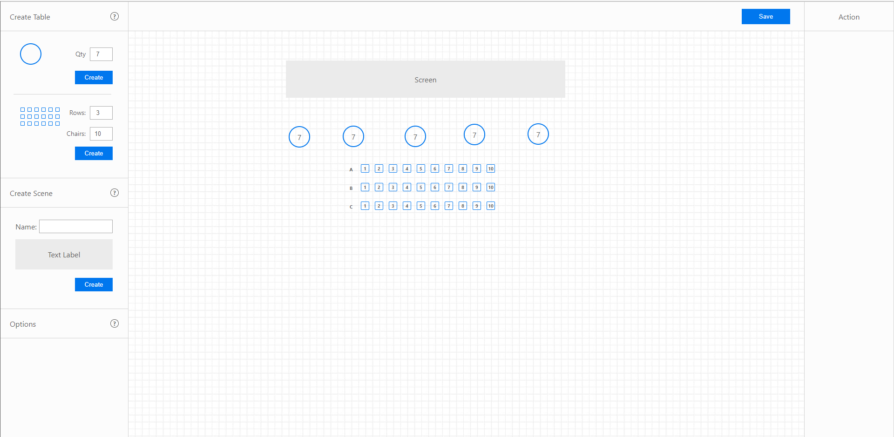
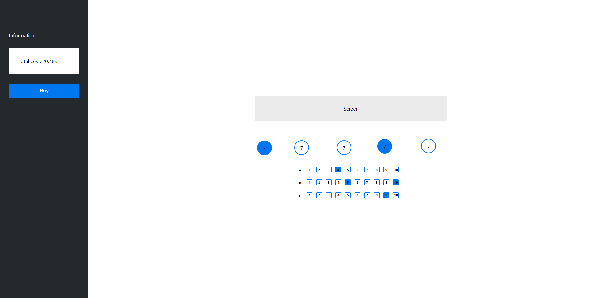
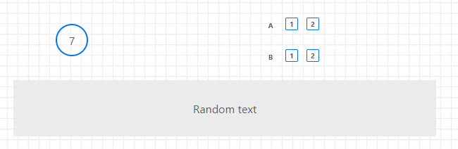
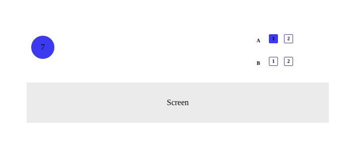

# Seat task 

The project contains **constructor in *back folder*** that helps you create different furnishings (tables, seats, scene) **using drag and drop**. 



Also contains ***front folder***. There are **guests** can see furnishings and **make orders**.


***Server folder*** contains logic that **take requests** and **give responses**.  Detailed description below.

## Installation
```bash 
$ git clone https://github.com/YaMainVoid/seat-task.git
```
When project have been downloaded you have to 
```bash
$ cd back 
$ npm i 
$ cd ../
$ cd front 
$ npm i
$ cd ../
$ cd server
$ npm i
```
You also can run the project using  ```$ npm start``` from back, front, server folders

## Transmitted data structure
### Components data structure
After arranging and clicking on the **Save button**, data will be sent to the server. Data will be contained in an array of objects. **The first object always has this structure**
```js
{
    type: 'container',
    width: Number,
    height: Number,
}
```
Data from the first object will help create adaptive container, it's needed for front end part.

**Other objects will have this structure**
```javascript
{
    id: Number,
    type: String,
    width: Number,
    height: Number,
    left: Number,
    top: Number,
    spec: { /* specific data for every component */}
}
```
The structure means that every object will have (expected the first of course) id, type, width, height, left, top, spec fields

Type can have these values: ```'table' || 'seats' || 'scene' ```

### ```spec``` for each component 

---

```spec``` for ```table``` looks like this 
```js
{
    state: String,
    cost: Number,
    qty: Number
}
```

Where state can have these values ```'free' || 'booked'```

---

```spec``` for ```scene``` looks like this 
```js
{
    name: String
}
```

---

```spec``` for ```seats``` looks like this 
```js
{
    seatWidth: Number,
    seatHeight: Number,
    seatMargin: Number,
    seatMarginBottom: Number,
    rows: Number,
    chairs: Number,
    seats_matrix: Array of Arrays
}
```
***Note***: only count of seats are included in chairs, not row number. [See below for an example](#example).

Now let's take a closer look at ```seats_matrix``` it's two-dimensional array. **The array contains arrays of objects**. Each object has **type field**.

```type``` can have these values ```'row_info', 'seat'```

object for ```type: 'row_info'```
```js
{
    id: Number,
    type: String,
    existed: Boolean,
    content: String
}
```

object for ```type: 'seat'```
```js
{
    id: Number,
    type: String,
    existed: Boolean,
    content: String,
    cost: Number,
    state: String,
}
```

This ```state``` is similar to the state of the table's ```spec.state```

#### Example



```javascript
[
    {
        type: 'container',
        width: 600,
        height: 100,
    }
    {
        id: 2,
        type: "table",
        width: 46,
        height: 46,
        top: 29,
        left: 30,
        spec: {
            state: "free",
            cost: 0,
            qty: 7
        }
    },
    {
        id: 13,
        type: "seats",
        width: 102,
        height: 90,
        top: 20,
        left: 466,
        spec: {
            seatWidth: 18,
            seatHeight: 18,
            seatMargin: 6,
            seatMarginBottom: 12,
            rows: 2,
            chairs: 2,
            seats_matrix: [
                [
                    {
                        id: 4,
                        type: 'row_info',
                        existed: true,
                        content: 'A'
                    },
                    {
                        id: 5,
                        type: 'seat',
                        existed: true,
                        content: 1,
                        cost: 0,
                        state: 'free'
                    },
                    {
                        id: 6,
                        type: 'seat',
                        existed: true,
                        content: 2,
                        cost: 0,
                        state: 'free'
                    }
                ],
                [
                    {
                        id: 7,
                        type: 'row_info',
                        existed: true,
                        content: 'B'
                    },
                    {
                        id: 8,
                        type: 'seat',
                        existed: true,
                        content: 1,
                        cost: 0,
                        state: 'free'
                    },
                    {
                        id: 9,
                        type: 'seat',
                        existed: true,
                        content: 2,
                        cost: 0,
                        state: 'free'
                    }
                ]
            ]
        }
    },
    {
        id: 15,
        type: "scene",
        width: 600,
        height: 80,
        top: 60,
        left: 20,
        spec: {
            name: 'Random text'
        }
    }
]
```

### Order data structure

***Note***: the structure is specific to front end part 

Order data is array of objects. Every object has these structure 

```javascript
{
    id: Number,
    type: String,
    cost: Number,
    additionalInfo: { /* there should be some additional info */ }
}
```

```additionalInfo``` for ```type: 'table'``` is empty object
```additionalInfo``` for ```type: 'seat'``` is object that contains row and chair fields. The structure looks like this 
```javascript
{
    row: Number,
    chair: Number
}
```

#### Example


```javascript
[
    {
        type: 'table',
        id: 2,
        cost: 0,
        additionalInfo: { /* nothing */ }
    },
    {
        type: 'seat',
        id: 5,
        cost: 0,
        additionalInfo: { 
            row: 1,
            chair: 1
        }
    }
]
```

## Back in detail

Everything is intuitively (if you clearly know react redux :P), but I'll talk about reducers. This will help to quickly understand program logic.

In ***reducers folder*** are 6 files 
* ***componentsStore.js*** - state is array of objects. Initially empty array. After clicking on **Create button** component will be added at componentsStore and its structure will have the same structure as the objects from the array that is transferred to the server ([*see the transmitted data structure/components data structure*](#transmitted-data-structure)) ***Note***: the state won't contain object with field `type: 'container'`, the object will added when we'll generate data for sending to server
* ***currentDragComponent.js*** - state is object. Initially empty object. When we start drag component, the component removes from componentsStore store and adds at currentDragComponent. When we finished to drag component adds at componentsStore and removes from currentDragComponent (state will be empty). ***Note:*** applies only for **Table** and **Seats**. **Scene** uses rnd (resizable and draggable) package, dragging happens without using  ***currentDragComponent***.
* ***index.js*** - there exports all reducers and combines, nothing unexpected :)
* ***inputsStore.js*** - state is array of objects. There store all inputs info (3 inputs with type number and 1 input with type text to be precise). Object has two fields `'name'`, `'value'`.

* ***resultModalWindow.js*** - state is object that contains two fields `message: ''` and `state: ''`. The `state` field can have 1 of 4 values: `''`, `'sending'`, `'successful'`, `'failed'`. When the admin clicks on the **save button** state is `'sending'`, data sended to server successfuly `'successful'`, something went wrong `'failed'`.
* ***serverCommunication.js*** - state is object that contains one field, it's `error: ''`. When an error occurs while transferring data to the server, the `error` will contain a line describing the problem.

***You can use Redux DevTools to understand even better what is happening in the program.***

#### May be interesting:
When you start dragging a component, a copy is created in the real DOM tree with the position absolute and left -1000 and this copy using like a draggable image (if don't do it then draggable image will look awful). When dragging has ended the copy is removed. It's not a spaggety, it's only one right way to set correct draggable image when you use html 5 dnd api.

## Front in detail 

Let's take a closer look at reducers.

In ***reducers folder*** are 4 files
* ***componentsStore.js*** - state is array of objects. On page loading data will be loaded from server. The data will have the structure described above. Check [*transmitted data structure/components data structure*](#transmitted-data-structure).
* ***index.js*** - there exports and combines all reducers. 
* ***orderStore.js*** - state is array of objects. Each object has these fields `'id'`, `'type`', `'cost`', `'additionalInfo'`. ***Important***: `'id'` from ***ordersStore*** is similar to `'id'` from ***componentsStore***. `'type`' can have these values: `'table'`, `'seat'`. `'additionalInfo'` for `'table'` is empty object, for `'seat'` is object contains `'row'`, `'chair'` fields.
* ***serverCommunication.js*** - state is object that contains one field, it's `error: ''`. When an error occurs while transferring data to the server, the `error` will contain a line describing the problem.
